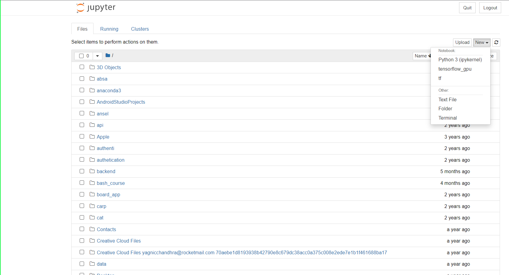

# **Project Setup**

## **Start Project**
<br>

### **1. Download Dataset**
   
To complete this challenge, you will need to start by setting it up:

Go to the link https://www.kaggle.com/datasets/stefanoleone992/fifa-21-complete-player-dataset?select=players_21.csv and click on download option on upper-right corner.


### **2. Setup workplace**

You can work on this project through any IDE or through kaggle notebook which you can create by clicking on New notebook option on upper-right corner.

For this tutorial, I would be using jupyter notebook


Opening new notebook




### **3. Information on Dataset**
   
   - The dataset at very high level consists of player data in general and the player data in FIFA. In this project, only the 2021 data of the players will be considered.
   - The general data of the players are in different "csv" files for all the years starting from 2015 to 2021.
   - The fifa data for all the years is stored in different sheets in a single excel file.

### **4. Importing libraries**

For every machine learning / Data Science project, there are certain libraries that are always used so we import them by default.

```python

import pandas as pd
import numpy as np
import matplotlib.pyplot as plt
import seaborn as sns

```

### **5. Importing the dataset**

```python
# loading data of players from 2021
player_data = pd.read_csv('./data/players_21.csv')
# Loading fifa data of players from 2021
fifa_data = pd.read_excel('./data/Career Mode player datasets - FIFA 15-21.xlsx', sheet_name="FIFA 21")

```
**Note**
- For the data files ending with csv, the read_csv is used for loading the data into dataframe.
- For the data files ending with xlsx, the read_xlsx is used for loading the data into dataframe and sheet_name parameter is being used to load the appropriate sheet from the excel file.

### **6. Importing Dataset Advanced**

- In this scenario, we will need to import all the sheets in the excel file to analyze and explore the data.
- To achieve this, we will be using dictionaries.
- First step will be to make an empty dictionary which we will call career_data_dict.

```python

career_data_dict = {}

```
- Note that we are using a function called as range() in the below code chunk. This function range is a basic python function which has three paramters. The first parameter is the initial value, the second parameter is final value and the last parameter is step value. In the below code 15 is the initial value and 22 is the final value and default step size is 1.

- As the excel file contains sheets from FIFA 15 to FIFA 21. We will be using a for loop to iterate over all the sheets as shown below.

```python

for i in range(15,22):
    career_data = pd.read_excel("Career Mode player datasets - FIFA 15-21.xlsx",sheet_name=f"FIFA {i}")
    career_data_dict[f"fifa_{i}"] = career_data 


```

- In the above python code, we have made a dictionary whose keys are fifa_15 to fifa_21. Hence to access fifa_15 we will be using below code.

```python

career_data_dict["fifa_15"]


```

### **7. Data Exploration**

**Note**

- As the columns in all the sheets have the same names. we need to change the names. We will be making a function to achieve this.

```python

def number_same_columns(career_data_dict):
    for index,key in zip(range(15,22),career_data_dict.keys()):
        career_data = career_data_dict[key]
        career_data.columns = [f"{column}_{index}"for column in career_data.columns]
        career_data_dict[key] = career_data
    return career_data_dict
```

```python

career_data_dict = number_same_columns(career_data_dict)


```

- In the above function, we are iterating the dictionary through the keys and using index to rename all the columns in that particular year to be column_year format. Hence if we check the code for 2015 data. It will be as below.

```python

career_data_dict["fifa_15"].head()

```


- As there are several columns in each sheet, lets check if all the years have same number of columns.This can be done using the below code.

```python

for key in career_data_dict.keys():
    print(career_data_dict[key].shape)


```


- As there are many players in the data, lets check for any duplicate player names. Also, there are two kinds of names. The short name might have duplicates, hence for this long name duplicates will be checked.


For Overall duplicates: 


```python

for key in career_data_dict.keys():
    print(career_data_dict[key].duplicated().sum())

```

For Long Name duplicates:

```python


for index,key in zip(range(15,22),career_data_dict.keys()):
    print(career_data_dict[key].duplicated(subset=f"long_name_{index}").sum())


```
```python
output: 
51
39
48
56
49
49
48
```

- It can be seen that, there are many long name duplicates in the data.
- It can be seen that in the below code chunk we are using function called zip. zip takes multiple arrays as input and from the multiple arrays it accesses elements from same indexes.

For short name duplicates:

```python


for index,key in zip(range(15,22),career_data_dict.keys()):
    print(career_data_dict[key].duplicated(subset=f"short_name_{index}").sum())


```

```python
output:

960
887
967
959
986
940
1060
```


- To check if all the players are unique or not, only fifaid can be used which is sofifa_id.

```python

for index,key in zip(range(15,22),career_data_dict.keys()):
    print(career_data_dict[key].duplicated(subset=f"sofifa_id_{index}").sum())


```

```python
output:

0
0
0
0
0
0
0
```


- Hence, we can see that there are no duplicate players in the data for different years.


### **8. Data Exploration Intermediate**

- An interesting code to write would be to get graph for individual player based on a particular attribute from the data. This can be achieved through the below code.

```python


def get_single_player_graphs_all_years(attribute_player, player_name):
    attribute_value_list = []
    for index,key in zip(list(range(15,22)),career_data_dict.keys()):
        career_data = career_data_dict[key]
        value = career_data.loc[career_data[f"short_name_{index}"]==player_name][f"{attribute_player}_{index}"].values[0]
        attribute_value_list.append(value)
    print(attribute_value_list)
    plt.plot(list(range(2015,2022)),attribute_value_list)
    plt.title(f"{player_name}-{attribute_player}")
    plt.xlabel("year")
    plt.ylabel(attribute_player)
    plt.show()
    
        


```

- This function takes the attribute of the player and name of the player and plots a graph for any numerical attribute in the data.
- The function can be called as shown below.

```python


get_single_player_graphs_all_years("potential","L. Messi")


```


- In the above code, we have called the function on attribute potential for Lionel Messi using the short name L. Messi.


**Exercise**

- Based on the previous duplicates function review, can you find out what kind of bugs the above function might have.


output:


- Another interesting aspect to this would be to make a function, which can give us the top 10 players for a particular attribute for each year. This can be achieved through the below code.

```python

def get_top_players_each_attribute(attribute_name,year, number_of_players):
    career_data = career_data_dict[f"fifa_{year}"]
    career_data = career_data.sort_values(by=f"{attribute_name}_{year}", ascending=False)
    career_data = career_data.head(number_of_players)[f"short_name_{year}"].values
    return career_data
    
    


```


- The above code will give us the top 10 players for a particular attribute in a given year.

```python

get_top_players_each_attribute("potential",21,10)


```

output:

```python
array(['K. Mbappé', 'L. Messi', 'J. Sancho', 'João Félix', 'Vinícius Jr.',
       'M. ter Stegen', 'K. Havertz', 'J. Oblak', 'T. Alexander-Arnold',
       'Cristiano Ronaldo'], dtype=object)
```


**Challenge**

Pause for 10 minutes here and try to replicate the above function for all the years and create a data frame as shown below.


**Answer**

The code to replicate the above challenge is as given below.

```python


top_10_each_year = pd.DataFrame()
top_10_each_year["ranking"] = list(range(1,11))
for year in range(15,22):
    player_list = get_top_players_each_attribute("potential", year, 10)
    top_10_each_year[f"20{year}"] = player_list
top_10_each_year


```

### **9. Data Exploration Advanced**

- Lets try to answer few questions using the data exploration.


            a. Top Player for each selected numerical attribute in the dataset for each year.
            b. Tallest player list for each year.
            c. Shortest player list for each year.
            d. Top 10 nationalities based on the number of players.
            e. youngest player for each year.

    a. Top Player List for selected numerical attributes.

```python

selected_attributes = ['pace',
 'shooting',
 'passing',
 'dribbling',
 'defending',
 'physic',
 'gk_diving',
 'gk_handling',
 'gk_kicking',
 'gk_reflexes',
 'gk_speed',
 'gk_positioning',
 'attacking_crossing',
 'attacking_finishing',
 'attacking_heading_accuracy',
 'attacking_short_passing',
 'attacking_volleys',
 'skill_dribbling',
 'skill_curve',
 'skill_fk_accuracy',
 'skill_long_passing',
 'skill_ball_control',
 'movement_acceleration',
 'movement_sprint_speed',
 'movement_agility',
 'movement_reactions',
 'movement_balance',
 'power_shot_power',
 'power_jumping',
 'power_stamina',
 'power_strength',
 'power_long_shots',
 'mentality_aggression',
 'mentality_interceptions',
 'mentality_positioning',
 'mentality_vision',
 'mentality_penalties',
 'mentality_composure',
 'defending_marking',
 'defending_standing_tackle',
 'defending_sliding_tackle',
 'goalkeeping_diving',
 'goalkeeping_handling',
 'goalkeeping_kicking',
 'goalkeeping_positioning',
 'goalkeeping_reflexes']

```

- For the above selected attributes, the number one player should be identified for each year. To get the top player for each attribute in the data, we will use the below function.

```python

def get_top_players_selected_attribute(selected_attributes,year):
    top_list = []
    for column in selected_attributes:
        career_data = career_data_dict[f"fifa_{year}"]
        career_data = career_data.sort_values(by=f"{column}_{year}", ascending=False).head(1)[f"short_name_{year}"].values[0]
        top_list.append(career_data)
    return top_list
        
        
        
   
    
    


```

- This function takes two parameters, one is list of selected attributes and year.
- This function gives a list output containing player short names for each attribute selected.
- Lets call this for the year 15 for the list of selected attributes.


```python


get_top_players_selected_attribute(selected_attributes,15)


```

```python
output:


['M. Bolly',
 'Cristiano Ronaldo',
 'A. Pirlo',
 'L. Messi',
 'Thiago Silva',
 'J. Van Damme',
 'Diego Alves',
 'T. Courtois',
 'M. Neuer',
 'V. Enyeama',
 'O. Kivrak',
 'M. Neuer',
 'A. Di María',
 'Cristiano Ronaldo',
 'Falcao',
 'Xavi',
 'Z. Ibrahimović',
 'L. Messi',
 'A. Pirlo',
 'A. Pirlo',
 'A. Pirlo',
 'L. Messi',
 'M. Bolly',
 'M. Bolly',
 'K. Kadyrov',
 'L. Messi',
 'Bernard',
 'Ronny',
 'D. Oduro',
 'C. Kramer',
 'A. Akinfenwa',
 'Cristiano Ronaldo',
 'G. Bedoya',
 'P. Lahm',
 'T. Müller',
 'A. Pirlo',
 'R. Lambert',
 'L. Messi',
 'Thiago Silva',
 'Thiago Silva',
 'P. Lahm',
 'Diego Alves',
 'T. Courtois',
 'M. Neuer',
 'M. Neuer',
 'V. Enyeama']
```


 **Challenge**

 This challenge involves using the above function to make a dataframe as below.

 


 **Answer**

 The above challenge can be successfully completed by using a for loop and by constructing a dataframe as below.

 ```python


top_player_attribute_df = pd.DataFrame()
top_player_attribute_df["attribute"] = selected_attributes
for year in range(15,22):
    list_players = get_top_players_selected_attribute(selected_attributes,year)
    top_player_attribute_df[f"20{year}"] = list_players
    
 ```


    1. Tallest Player List for each year.

       - This exercise is little tricky as it entails finding a tallest player list. As several players can have same height we might get a list of players or single player sometimes. Lets make a function to get the tallest player list first.


```python


def get_tallest_player(year):
    career_data = career_data_dict[f"fifa_{year}"]
    player_list_df = career_data.loc[career_data[f"height_cm_{year}"]==career_data[f"height_cm_{year}"].max()]
    player_list = player_list_df[f"short_name_{year}"].values
    return player_list


```

- In the above function we are getting into the career_data_dict and accessing the year 2015 data. After getting the year 2015 data, we are using loc to filter the data to get only the tallest players.
- Then we are getting the short names of the tallest players and saving it to a list and returning the list.


```python
output:


array(['J. Mooney', 'T. Aarøy'], dtype=object)

```


**Challenge**

The challenge is to get the list of tallest players for each year in a dictionary where the key will be the year and values will be the list of tallest players.

```python

expected output:

{'2015': array(['J. Mooney', 'T. Aarøy'], dtype=object),
 '2016': array(['K. Van Hout'], dtype=object),
 '2017': array(['K. Van Hout'], dtype=object),
 '2018': array(['T. Holý'], dtype=object),
 '2019': array(['T. Holý', 'D. Hodzic'], dtype=object),
 '2020': array(['T. Holý'], dtype=object),
 '2021': array(['T. Holý'], dtype=object)}


```
 **Answer**

- The above challenge can be easily achieved using a loop and dictionary as shown below.

```python

tallest_player_dict = {}
for year in range(15,22):
    tallest_player_list = get_tallest_player(year)
    tallest_player_dict[f"20{year}"] = tallest_player_list


```


**Challenge** 

The shortest player list for each year will be similar to the tallest player list code. Please try to do it as an exercise.


    3. Top 10 Nationalities based on the number of players in the data.
   
       - First step would be to get top 10 nationalities for a particular year by making a function.

```python


def get_top_nationalities(year):
    list_nationalities = []
    career_data = career_data_dict[f"fifa_{year}"]
    nationality_count = career_data.groupby(f"nationality_{year}").size()
    sorted_nationality_count = nationality_count.sort_values(ascending=False)
    top_10_list = sorted_nationality_count.head(10).index.values
    return top_10_list


```

- In the above function, we are getting the career data for a particular year first. Then using the groupby on the nationality to get the count of players in each nationality.
- Then sorting the dataframe to get the nationalities sorted based on the number of players in descending order.
- Then geting the top 10 list of the nationalities based on the data and returning the list.


```python

get_top_nationalities(15)


```

```python
output:


array(['England', 'Spain', 'France', 'Argentina', 'Italy', 'Germany',
       'Colombia', 'Republic of Ireland', 'Netherlands', 'Mexico'],
      dtype=object)
```


**Challenge**

By using the above function, get the list of countries for all the years and make a dataframe as shown below.


**Answer**

The above challenge is similar to other challenges given. This can be achieved using a for loop and dataframe.


```python


top_10_nationality_df = pd.DataFrame()
top_10_nationality_df["ranking"] = list(range(1,11))

for index in range(15,22):
    list_nations = get_top_nationalities(index)
    top_10_nationality_df[f"20{index}"] = list_nations
    
    


```


**Challenge**

The last challenge in this exercise is to find the youngest player for each year. Which should be done by the reader.
